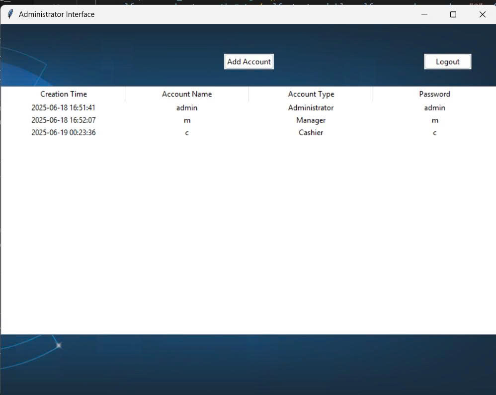
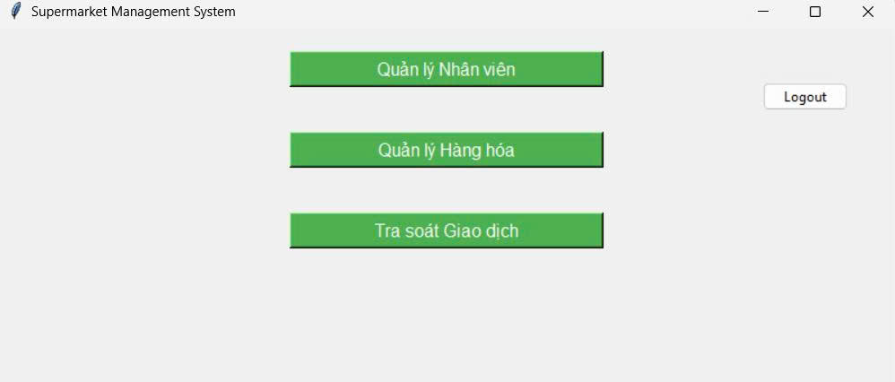
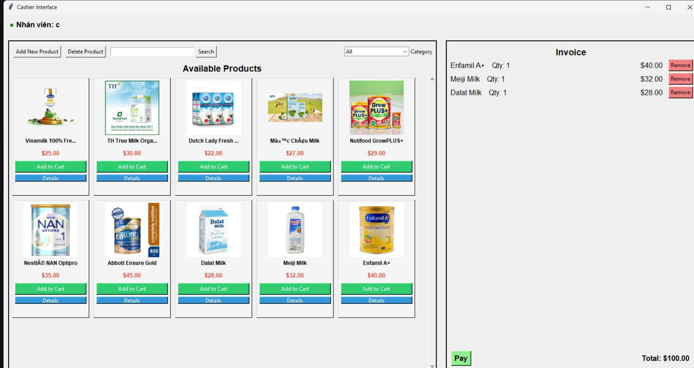

# Supermarket Management System

## Description

The Supermarket Management System is a comprehensive solution for managing a retail store with modules for administration, inventory management, sales, and employee tracking. The application provides different interfaces for administrators, managers, and cashiers, each with specific functions tailored to their roles.

## Features

### Admin Interface

<p align="center">
  
</p>
- User account management (create, view, delete, update accounts)
- Password management for all users
- Access control based on user roles

### Manager Interface
<p align="center">
  
</p>
- Employee time tracking and management
- Employee payment calculation
- Inventory management and stock updates
- Transaction monitoring with date filtering

### Cashier Interface
<p align="center">
  
</p>
- Product catalog with images and details
- Shopping cart functionality
- Invoice generation and payment processing
- Product management (add, delete, search)
- Category filtering

## System Requirements

- **Python 3.7+**
- **SQLite3**
- **Dependencies**:
  - tkinter
  - PIL (Pillow)
  - tkcalendar

## Installation

1. Clone the repository:

   ```bash
   git clone https://github.com/yourusername/Supermarket_management.git
   cd Supermarket_management
   ```

2. Install dependencies:

   ```bash
   pip install pillow tkcalendar
   ```

3. Initialize the database:

   ```bash
   cd Code
   python initialize_database.py
   ```

4. Run the application:

   ```bash
   python SuperMaket_Interface.py
   ```

## Usage

### Login Credentials
**Default admin account:**
- Username: admin
- Password: admin
- Role: Administrator

### Interface Navigation

1. **Admin Interface**:
   - Add new user accounts
   - View and manage existing accounts
   - Delete accounts or reset passwords

2. **Manager Interface**:
   - View employee work hours
   - Calculate and process payments
   - Update product inventory
   - Monitor sales transactions

3. **Cashier Interface**:
   - Sell products to customers
   - Add products to the cart
   - Process payments
   - Print invoices
   - Manage product catalog

## Project Structure

```bash
Supermarket_management/
├── .gitignore
├── README.md
├── Code/
│   ├── admin_interface.py
│   ├── cashier_interface.py
│   ├── manager_interface.py
│   ├── db_utils.py
│   ├── initialize_database.py
│   ├── SuperMaket_Interface.py
│   ├── supermarket.db
│   └── supermarket.sql
├── img/
│   ├── bg1.png
│   ├── bg2.png
│   ├── product_images/
│   └── ...
```

## Technologies Used

- **Python** - Core programming language
- **Tkinter** - GUI library
- **SQLite** - Embedded database
- **PIL (Pillow)** - Image processing
- **tkcalendar** - Date picker widget

## Author

Do Doan

## License

This project is used for learned.


